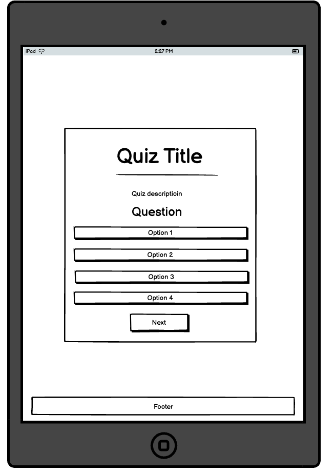
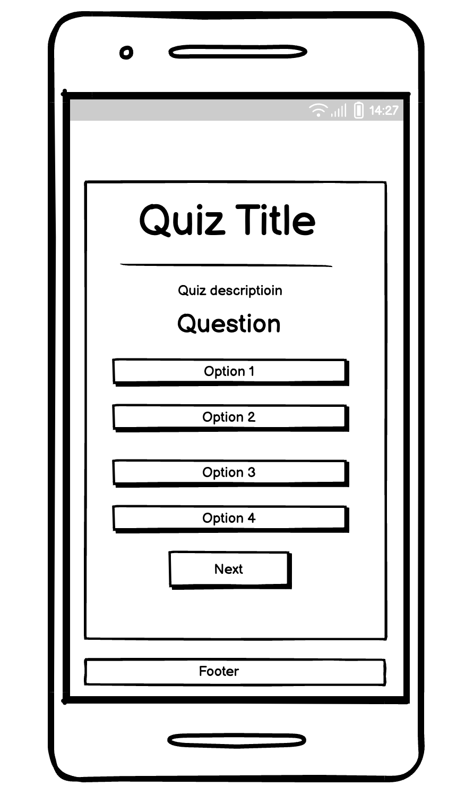
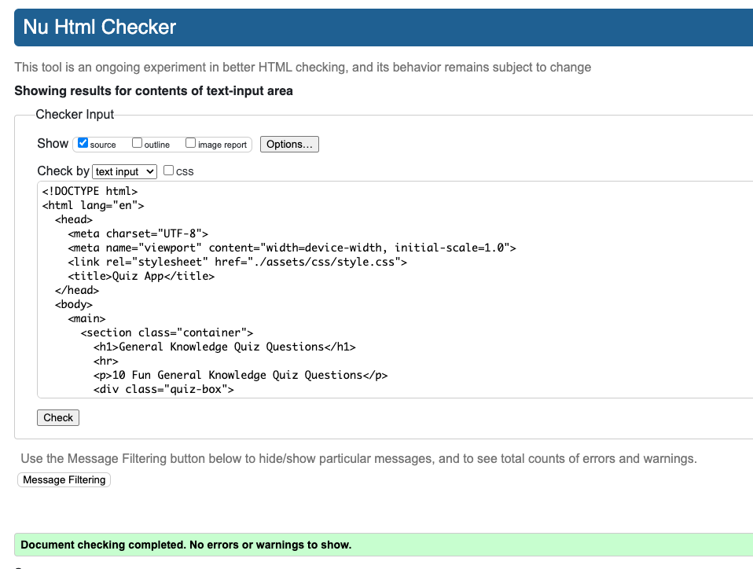
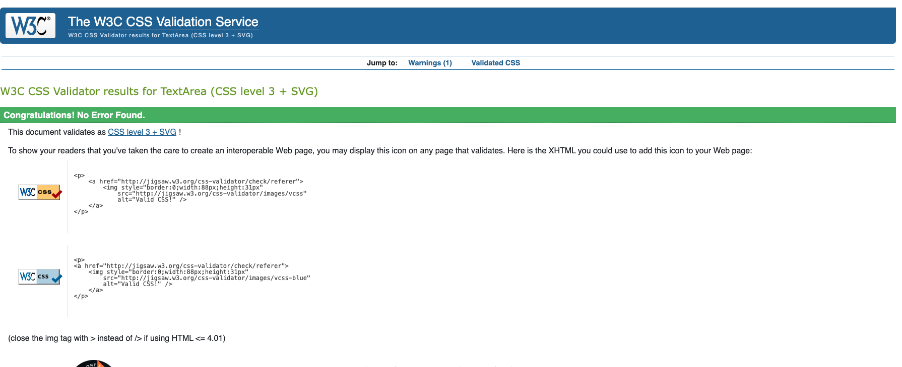
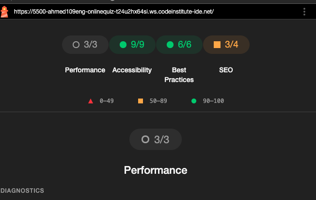
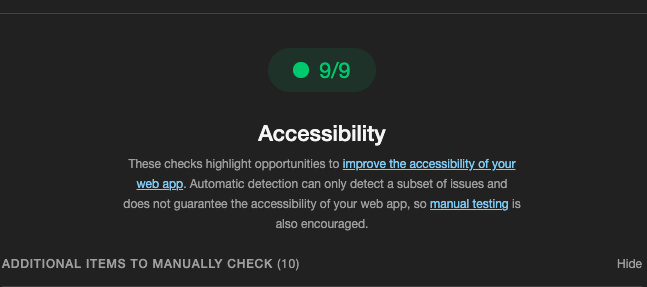
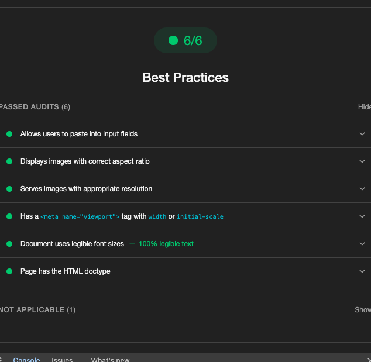
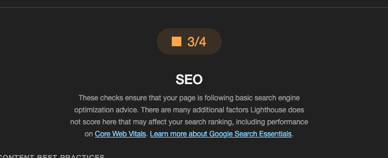
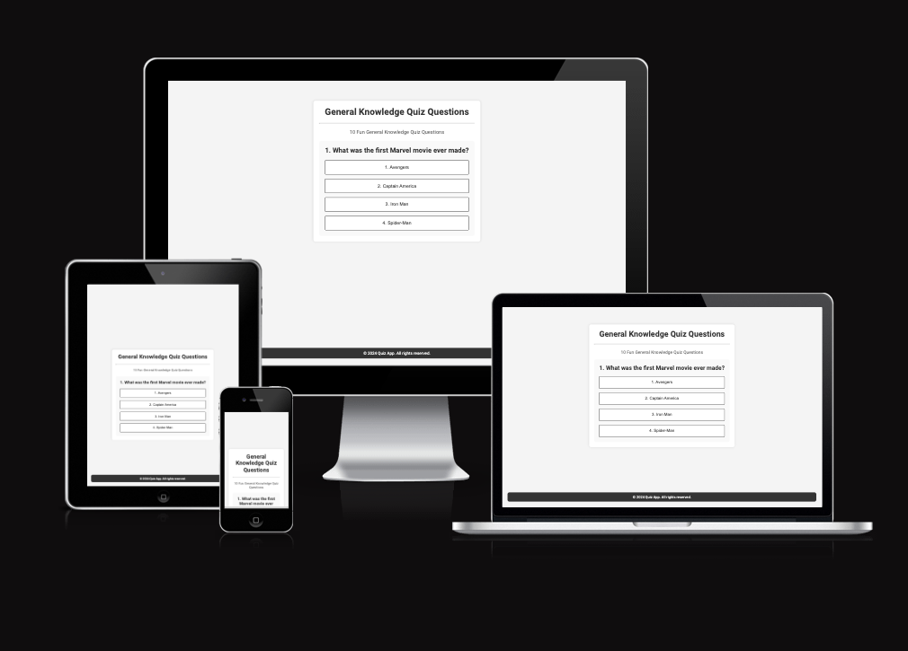

# Project Overview
## Project Name: Quiz App

### Objective:
The goal of the Quiz App is to create an interactive and responsive quiz Page that allows users to test their general knowledge through multiple-choice questions. The app provides an engaging experience with a clean and intuitive user interface, accessible on various devices, including desktops, tablets (like the iPad Pro), and smartphones.

# User stories

### User Story 1: 
* As a user, I want to answer multiple-choice questions,
So that I can test my knowledge on various topics.
### User Story 2: 
* As a user, I want to move to the next question after answering the current one,
So that I can continue the quiz without interruptions.
### User Story 3:
* As a user, I want to use the page on different devices (desktop, tablet, and mobile),
So that I can use the quiz app regardless of the device I’m using.
### User Story 4:
* As a user, I want to see which questions I have answered,
So that I can know how far I’ve progressed in the quiz.
### User Story 4:
* As a user, I want to restart the quiz after completion,
So that I can try again to improve my score.

# Accepted Criteria
###  Accepted Criteria 1:
* Each question is displayed with four possible answers.
I can select one answer by clicking on the corresponding button.
After selecting an answer, I can proceed to the next question.
###  Accepted Criteria 2:
* A "Next" button appears after I select an answer.
Clicking the "Next" button displays the following question.
The previous question and selected answer are not shown again unless I restart the quiz.
###  Accepted Criteria 3:
* The app layout adjusts based on the device screen size.
Buttons, text, and other UI elements are easy to interact with on all devices.
###  Accepted Criteria 4:
* The app can display the total number of questions and how many have been answered Correctly.
###  Accepted Criteria 4:
* Clicking "Try again" resets the quiz to the first question. 
The user’s previous answers are cleared 

# Wireframes: 

I used Balsamiq to craft wireframes

* Desktop view

;

* Tablet view (Ipad pro)

;

* Mobile view

;

# Testing :

## Validation: 

* HTML Validation
;

* CSS Validation

;

# Performance testing:

I used Google Lighthouse to analyses the page on performance, accessibility, best practices,  and SEO.

;
;
;
;

# FResponsive

;

# Deployment
I used github pages to deploy the website.
live site https://ahmed109-eng.github.io/quiz-app/ 

# Credits 
https://www.w3schools.com/#gsc.tab=0&gsc.q=add%20sound%20 
https://www.youtube.com/watch?v=lV2BMXdsDmc
https://www.youtube.com/watch?v=PBcqGxrr9g8
https://www.youtube.com/watch?v=riDzcEQbX6k
https://www.youtube.com/watch?v=MIYQR-Ybrn4
https://stackoverflow.com/

